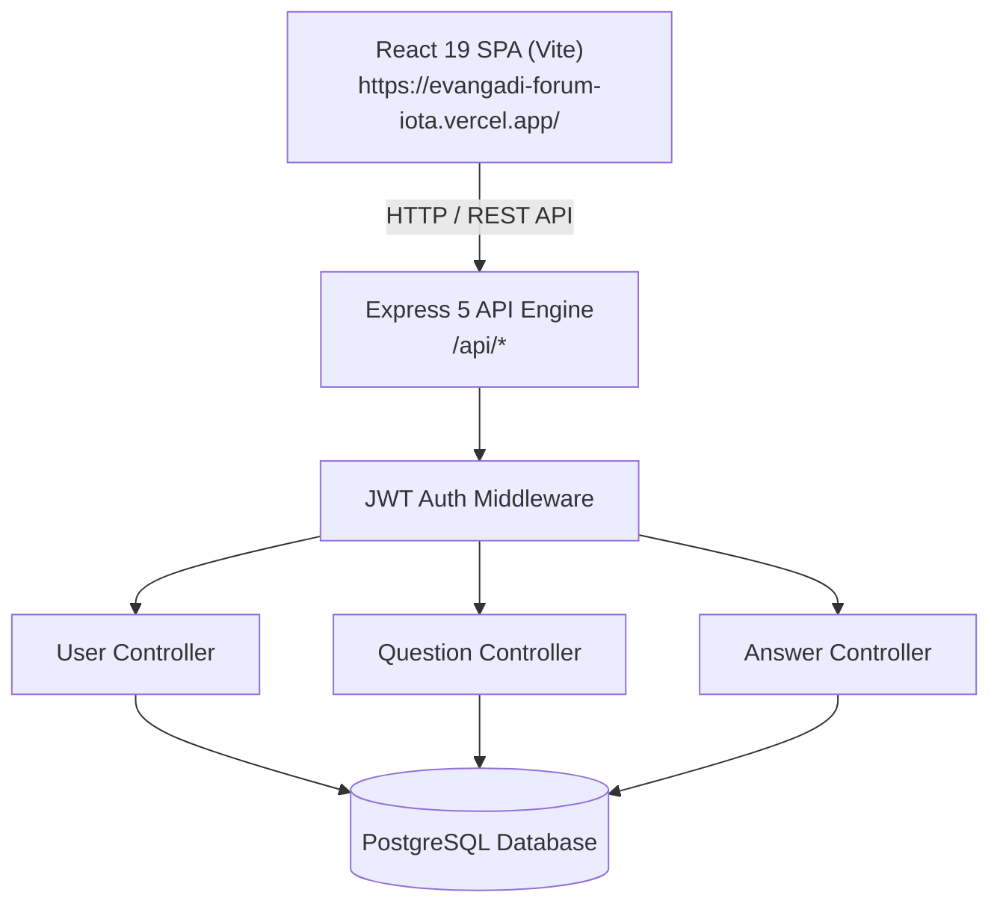
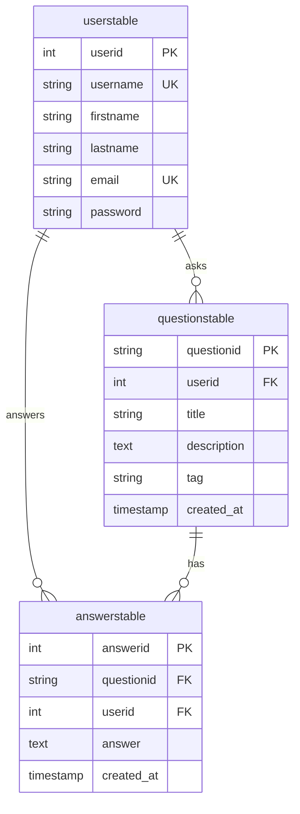

# 💬 Evangadi Forum - Q&A Community Platform

<p align="center">
  <a href="https://evangadi-forum-iota.vercel.app/">
    
  </a>
  <a href="https://evangadi-forum-iota.vercel.app/api-status">
    
  </a>
</p>

<p align="center">
  
  
  
  
  
  
  
</p>

---

## 🌐 Live Application Links

- 🔗 **Frontend Web Application**: [https://evangadi-forum-iota.vercel.app/](https://evangadi-forum-iota.vercel.app/)
- ⚡ **Backend API Health Check**: [https://evangadi-forum-iota.vercel.app/api-status](https://evangadi-forum-iota.vercel.app/api-status)

---

## 📋 Table of Contents

- [Overview](#-overview)
- [Key Features](#-key-features)
- [Tech Stack](#%EF%B8%8F-tech-stack)
- [System Architecture](#-system-architecture)
- [Database Schema](#-database-schema)
- [API Reference](#-api-reference)
- [Project Structure](#-project-structure)
- [Environment Configuration](#-environment-configuration)
- [Getting Started (Local Setup)](#-getting-started-local-setup)
- [Vercel Deployment Guide](#-vercel-deployment-guide)
- [Contributing](#-contributing)
- [License & Authors](#-license--authors)

---

## 📌 Overview

**Evangadi Forum** is a full-stack, interactive Q&A community platform engineered to facilitate knowledge sharing among students, developers, and tech enthusiasts. Inspired by platforms like Stack Overflow, Evangadi Forum allows registered users to ask questions, share answers, engage in technical discussions, and explore community knowledge.

The platform is designed with a modern decoupled architecture using **React 19** with **Vite** on the frontend, **Node.js** & **Express 5** on the backend, and **PostgreSQL** for relational data persistence.

---

## ✨ Key Features

- 🔐 **User Authentication & Authorization**:
  - Secure registration and login flow.
  - Password encryption using **Bcrypt**.
  - Stateless authentication with **JSON Web Tokens (JWT)**.
  - Protected API routes and client-side route guards.

- ❓ **Questions Portal**:
  - Create and publish questions with detailed descriptions and categorizing tags.
  - Paginated question list view with search and filter capabilities.
  - Dedicated question pages showing complete description and timestamp.

- 💬 **Answers & Collaboration**:
  - Submit answers to community questions.
  - Real-time display of community contributions and answer counts.
  - Detailed author metadata for every question and answer.

- 🎨 **Modern Responsive Interface**:
  - Fully responsive, mobile-first design built with **Bootstrap 5** & **Material UI**.
  - Smooth micro-animations powered by **Framer Motion**.
  - Integrated "How It Works" guide and custom 404 page.

- ⚡ **Automated DB Migrations**:
  - Automatic table creation and schema validation (`userstable`, `questionstable`, `answerstable`) upon server boot.

---

## 🛠️ Tech Stack

| Domain | Technology / Library | Description |
| :--- | :--- | :--- |
| **Frontend** | React 19 (SPA) | UI Component Framework |
| | Vite 6.3 | Next-generation frontend build tooling |
| | React Router 7 | Client-side routing and navigation |
| | Axios | Promise-based HTTP client |
| | Bootstrap 5 & Emotion | Responsive layout and UI components |
| | Framer Motion & MUI Icons | Micro-animations and icon suite |
| **Backend** | Node.js & Express 5 | Asynchronous server runtime & REST API framework |
| | PostgreSQL (`pg` module) | Relational database & native connection pool |
| | JSON Web Token (`jsonwebtoken`) | Secure JWT authentication & verification |
| | Bcrypt | Password hashing and salt generation |
| **Deployment**| Vercel | Production hosting for Frontend & Serverless API |

---

## 🏗️ System Architecture



---

## 🗄️ Database Schema

The platform relies on three relational PostgreSQL tables with foreign key constraints:



---

## 🚀 API Reference

### Base URL
- **Live Server**: `https://evangadi-forum-iota.vercel.app/api`
- **Local Server**: `http://localhost:5500/api`

### Endpoints

| Category | Method | Endpoint | Auth | Description |
| :--- | :--- | :--- | :--- | :--- |
| **Health** | `GET` | `/api-status` | ❌ | Returns backend API status message |
| **Users** | `POST` | `/api/users/register` | ❌ | Register a new user account |
| **Users** | `POST` | `/api/users/login` | ❌ | Authenticate user and return JWT token |
| **Users** | `GET` | `/api/users/check` | ✅ | Verify session token and retrieve user info |
| **Questions**| `GET` | `/api/questions` | ✅ | Fetch all community questions |
| **Questions**| `GET` | `/api/questions/:questionid` | ✅ | Fetch details for a specific question |
| **Questions**| `POST` | `/api/questions` | ✅ | Post a new question |
| **Answers** | `GET` | `/api/answers/:questionid` | ✅ | Fetch all answers for a question |
| **Answers** | `POST` | `/api/answers` | ✅ | Post an answer to a question |

---

## 📁 Project Structure

```
Evangadi-ForumG1/
├── client/                     # Frontend Application (React 19 + Vite)
│   ├── public/                 # Static public assets
│   ├── src/
│   │   ├── assets/             # Logos and graphic assets
│   │   ├── components/         # Reusable layout & UI components
│   │   ├── pages/              # Route pages (Home, Questions, Answers, Signup, 404, HowItWorks)
│   │   ├── utiltis/            # Axios instance and API interceptors
│   │   ├── App.jsx             # Main Application routing and Auth Context
│   │   ├── main.jsx            # React root entrypoint
│   │   └── index.css           # Global stylesheet
│   ├── .env                    # Client environment configuration
│   ├── .env.example            # Environment template
│   ├── package.json            # Frontend dependencies
│   ├── vercel.json             # Vercel client routing config
│   └── vite.config.js          # Vite build configuration
│
└── server/                     # Backend API Service (Express 5 + PostgreSQL)
    ├── controller/             # Business logic handlers
    ├── db/                     # PostgreSQL pool connection
    ├── middleware/             # JWT Auth verification middleware
    ├── migrate/                # Auto-migration table schema script
    ├── routes/                 # Express API routes
    ├── .env                    # Server environment configuration
    ├── app.js                  # Main Express application entrypoint
    └── package.json            # Server dependencies
```

---

## ⚙️ Environment Configuration

### Backend Environment (`server/.env`)

```env
PORT=5500
DB_HOST=localhost
DB_PORT=5432
DB_USER=postgres
DB_PASSWORD=your_password
DB_NAME=evangadi_forum
JWT_SECRET=your_super_secret_jwt_key
```

### Frontend Environment (`client/.env`)

```env
# Live API Endpoint
VITE_API_URL=https://evangadi-forum-iota.vercel.app/api

# For local development:
# VITE_API_URL=http://localhost:5500/api
```

---

## 💻 Getting Started (Local Setup)

### Prerequisites
- **Node.js** (v18.0.0 or higher)
- **npm** (v9.0.0 or higher)
- **PostgreSQL** database server

### 1. Clone the Repository
```bash
git clone https://github.com/abera-hiluf/evangadiforum-me-project.git
cd evangadiforum-me-project/Evangadi-ForumG1
```

### 2. Start Backend Server
```bash
cd server
npm install
# Create .env file with your database credentials
npm run dev
```
*Backend server will start at `http://localhost:5500`.*

### 3. Start Frontend Client
```bash
# Open a new terminal window
cd client
npm install
# Ensure client/.env has VITE_API_URL=http://localhost:5500/api
npm run dev
```
*Frontend app will start at `http://localhost:5173`.*

---

## 🚀 Vercel Deployment Guide

This project is optimized for seamless deployment on **Vercel**:

1. **Deploy Frontend**:
   - Connect repository to Vercel.
   - Set Root Directory to `client`.
   - Set Framework Preset to **Vite**.
   - Add environment variable `VITE_API_URL=https://evangadi-forum-iota.vercel.app/api`.
   - Click **Deploy**.

2. **Deploy Backend**:
   - Set Root Directory to `server`.
   - Add database environment variables (`DB_HOST`, `DB_USER`, `DB_PASSWORD`, `DB_NAME`, `JWT_SECRET`).
   - Click **Deploy**.

---

## 🤝 Contributing

Contributions, issues, and feature requests are welcome!

1. Fork the Project.
2. Create your Feature Branch (`git checkout -b feature/AmazingFeature`).
3. Commit your Changes (`git commit -m 'Add some AmazingFeature'`).
4. Push to the Branch (`git push origin feature/AmazingFeature`).
5. Open a Pull Request.

---

## 📄 License & Authors

Distributed under the **ISC License**.

Created & Maintained by **Abraham Hiluf** and the Evangadi Community.

- 🌐 Live Site: [https://evangadi-forum-iota.vercel.app/](https://evangadi-forum-iota.vercel.app/)
