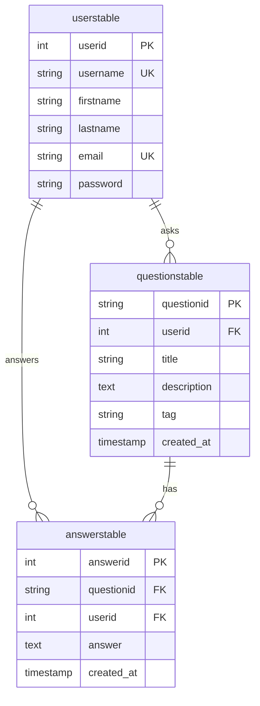

# 💬 Evangadi Forum - Q&A Community Platform

<p align="center">
  
  
  
  
  
  
</p>

---

## 📌 Overview

**Evangadi Forum** is a full-stack, interactive Q&A community platform engineered to facilitate knowledge sharing among students, developers, and tech enthusiasts. Modeled after developer forums like Stack Overflow, the platform empowers users to ask questions, share answers, explore topics, and engage with a growing tech community.

The platform is built with a modern decoupled architecture utilizing **React 19 & Vite** on the frontend, **Node.js & Express 5** on the backend, and **PostgreSQL** for relational data persistence.

---

## ✨ Features

- 🔐 **User Authentication & Security**:
  - Secure registration & login system.
  - Password hashing with **Bcrypt**.
  - Token-based stateless authentication using **JSON Web Tokens (JWT)**.
  - Protected API routes and client-side auth context.

- ❓ **Questions Management**:
  - Post detailed questions with titles, tags, and rich descriptions.
  - Browse a global feed of community questions with pagination.
  - Search and filter questions by keywords.
  - View dedicated question pages with full context.

- 💬 **Answers & Collaboration**:
  - Provide answers to community questions.
  - Dynamic user-attribution showing author details and creation timestamps.
  - Real-time display of answer counts and contributions.

-  **Modern Responsive UI/UX**:
  - Clean, mobile-friendly interface built with Bootstrap 5 and Material UI icons.
  - Smooth animations powered by Framer Motion.
  - Interactive "How It Works" guide for new users.
  - Customized 404 page and stateful loader indicators.

- ⚙️ **Automated DB Migrations**:
  - Automatic table creation (`userstable`, `questionstable`, `answerstable`) upon backend startup.

---

## 🛠️ Tech Stack

### Frontend
- **Framework**: React 19 SPA
- **Build Tool**: Vite
- **Styling**: Bootstrap 5, Emotion, Custom CSS
- **Icons & Motion**: React Icons, Material UI Icons, Framer Motion
- **HTTP Client**: Axios
- **Routing**: React Router 7

### Backend
- **Runtime**: Node.js
- **Framework**: Express.js (v5)
- **Database**: PostgreSQL (native `pg` pool driver)
- **Security**: JWT (`jsonwebtoken`), Password Hashing (`bcrypt`)
- **Config & Middleware**: Cors, Dotenv, HTTP Status Codes, UUID

---

##  Project Structure

```
Evangadi-ForumG1/
├── client/                     # React Frontend Application
│   ├── public/                 # Static assets
│   ├── src/
│   │   ├── assets/             # Images and logos
│   │   ├── components/         # Reusable UI components (Header, Footer, Layout)
│   │   ├── pages/              # App Pages (Home, Questions, Answers, Signup, 404, HowItWorks)
│   │   ├── utiltis/            # Axios instance and helper utilities
│   │   ├── App.jsx             # Main routes & Auth context wrapper
│   │   ├── main.jsx            # Application entrypoint
│   │   └── index.css           # Global stylesheet
│   ├── .env.example            # Environment variables template for Client
│   ├── package.json            # Client dependencies and scripts
│   └── vite.config.js          # Vite configuration
│
└── server/                     # Express Backend API & Database
    ├── controller/             # Request handlers (userController, questionController, answerController)
    ├── db/                     # PostgreSQL pool connection configuration
    ├── middleware/             # Auth JWT verification middleware
    ├── migrate/                # Schema auto-creation script (createTable.js)
    ├── routes/                 # Express API routes (userRoutes, questionRoutes, answerRoutes)
    ├── .env                    # Server environment variables
    ├── app.js                  # Main Express server entrypoint
    └── package.json            # Server dependencies and scripts
```

---

## 🗄️ Database Schema

The database consists of three relational PostgreSQL tables with foreign key constraints and cascade actions:



---

## 🚀 API Endpoint Reference

| Category | Endpoint | Method | Auth Required | Description |
| :--- | :--- | :--- | :--- | :--- |
| **Status** | `/api-status` | `GET` | ❌ No | Health check endpoint |
| **Auth** | `/api/users/register` | `POST` | ❌ No | Register a new user |
| **Auth** | `/api/users/login` | `POST` | ❌ No | Authenticate user and issue JWT |
| **Auth** | `/api/users/check` | `GET` | ✅ Yes | Verify current user session token |
| **Questions** | `/api/questions` | `GET` | ✅ Yes | Retrieve all posted questions |
| **Questions** | `/api/questions/:questionid` | `GET` | ✅ Yes | Retrieve single question details |
| **Questions** | `/api/questions` | `POST` | ✅ Yes | Create a new question |
| **Answers** | `/api/answers/:questionid` | `GET` | ✅ Yes | Retrieve all answers for a question |
| **Answers** | `/api/answers` | `POST` | ✅ Yes | Submit an answer to a question |

---

##  Getting Started

### Prerequisites

Ensure you have the following installed on your local system:
- **Node.js** (v18.x or higher)
- **npm** (v9.x or higher)
- **PostgreSQL** database server running locally or hosted (e.g., ElephantSQL, Supabase, Neon)

---

### 1. Database Setup

Create a PostgreSQL database (e.g., `evangadi_forum`). The backend automatically creates necessary tables upon startup.

---

### 2. Backend Setup

1. Navigate to the server directory:
   ```bash
   cd server
   ```

2. Install dependencies:
   ```bash
   npm install
   ```

3. Create a `.env` file inside the `server/` directory:
   ```env
   PORT=5500
   DB_HOST=localhost
   DB_PORT=5432
   DB_USER=postgres
   DB_PASSWORD=your_postgres_password
   DB_NAME=evangadi_forum
   JWT_SECRET=your_jwt_secret_key
   ```

4. Start the server:
   ```bash
   # Development mode with nodemon
   npm run dev

   # Production mode
   npm start
   ```
   *The server will start on `http://localhost:5500`.*

---

### 3. Frontend Setup

1. Open a new terminal and navigate to the client directory:
   ```bash
   cd client
   ```

2. Install dependencies:
   ```bash
   npm install
   ```

3. Create a `.env` file in the `client/` directory:
   ```env
   VITE_API_URL=http://localhost:5500/api
   ```

4. Launch the dev server:
   ```bash
   npm run dev
   ```
   *The client app will be accessible at `http://localhost:5173`.*

---

##  Production Deployment

1. **Build Client Bundle**:
   ```bash
   cd client
   npm run build
   ```
   This compiles optimized production static assets into `client/dist`.

2. **Serve with Express**:
   The Express server (`server/app.js`) is pre-configured to serve static build assets from `client/dist` and fallback SPA navigation.

---

## 🤝 Contributing

Contributions are what make the open-source community an amazing place to learn, inspire, and create.
1. Fork the Project
2. Create your Feature Branch (`git checkout -b feature/AmazingFeature`)
3. Commit your Changes (`git commit -m 'Add some AmazingFeature'`)
4. Push to the Branch (`git push origin feature/AmazingFeature`)
5. Open a Pull Request

---

## 📄 License & Author

Distributed under the **ISC License**.

Developed with ❤️ by **Abera Hiluf** & the Evangadi Community.
